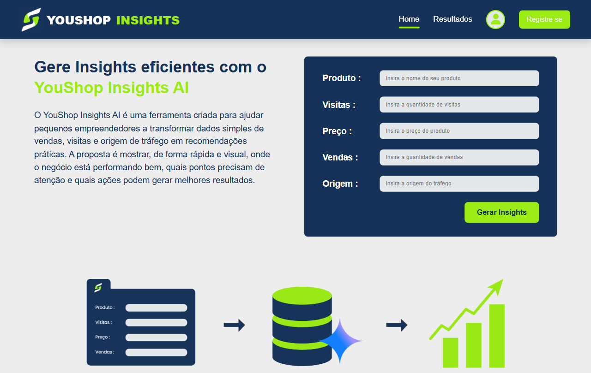

# YouShop Insights AI

Aplicação web desenvolvida com **Python**, **Flask**, **SQLite**, **HTML**, **CSS**, **JavaScript** e integração com a **API Google Gemini**, criada para gerar insights de vendas a partir de dados simples informados pelo usuário.

O projeto foi desenvolvido como parte de um **desafio técnico para uma vaga de estágio em desenvolvimento full stack**.



## 🌐 Acesse o projeto online

[Clique aqui para acessar o YouShop Insights AI (Ctrl + clique para abrir em uma nova aba)](https://youshop-insights-ai-production.up.railway.app/)

---

## 💻 Sobre o projeto

O **YouShop Insights AI** é uma ferramenta voltada para pequenos empreendedores digitais e creators que desejam entender melhor o desempenho dos seus produtos.

A partir de dados como visitas, vendas, preço e origem do tráfego, o sistema calcula métricas importantes e utiliza inteligência artificial para gerar recomendações práticas. A proposta é transformar informações simples em uma análise mais clara, ajudando o usuário a identificar pontos fortes, oportunidades de melhoria e possíveis ações para otimizar seus resultados.

---

## ⚙️ Tecnologias utilizadas

- **Python:** utilizado na lógica principal da aplicação, no tratamento dos dados e no cálculo das métricas.

- **Flask:** framework responsável pelas rotas, renderização das páginas HTML e comunicação entre o formulário e o back-end.

- **SQLite:** banco de dados utilizado para armazenar os produtos cadastrados e manter o histórico de análises.

- **Google Gemini API:** utilizada para gerar insights personalizados com base nos dados informados pelo usuário.

- **HTML:** responsável pela estrutura das páginas da aplicação.

- **CSS:** utilizado para estilizar a interface, seguindo uma identidade visual mais próxima da proposta do projeto.

- **JavaScript:** aplicado em pequenas interações da interface, como o feedback visual durante o envio do formulário.

- **Railway:** plataforma utilizada para realizar o deploy da aplicação e disponibilizá-la online.

---

## Como o sistema funciona

O fluxo principal da aplicação segue estas etapas:

1. O usuário preenche o formulário com os dados do produto.
2. O Flask recebe as informações enviadas pelo formulário.
3. Os dados são salvos em um banco SQLite.
4. O sistema calcula automaticamente a taxa de conversão e o faturamento.
5. A API Google Gemini recebe os dados processados e gera insights personalizados.
6. A página de resultados exibe métricas, recomendações e o histórico de análises cadastradas.

---

## Funcionalidades

- Cadastro de produtos para análise.
- Cálculo automático da taxa de conversão.
- Cálculo automático do faturamento.
- Classificação do desempenho da conversão.
- Geração de insights com inteligência artificial.
- Histórico de análises cadastradas.
- Visualização individual de cada análise.
- Interface web personalizada.

---

## 📁 Estrutura do projeto

```plaintext
youshop-insights-ai/
├── app.py
├── database.py
├── insights_ai.py
├── requirements.txt
├── database/
│   └── youshop.db
├── static/
│   ├── css/
│   ├── js/
│   └── images/
└── templates/
    ├── base.html
    ├── home.html
    └── resultado.html
```

---

## Observação sobre a API

> [!CAUTION]
> A geração dos insights depende da API gratuita do Google Gemini. Por isso, podem existir limites de requisições em um curto período de tempo. Caso muitos testes sejam feitos em sequência, a geração automática de insights pode apresentar instabilidade temporária ou retornar uma resposta alternativa do sistema.

---

## Objetivo

O objetivo deste projeto foi desenvolver uma aplicação full stack funcional para um desafio técnico, integrando interface web, back-end em Python, banco de dados, consumo de API externa e deploy online.

A proposta principal foi criar uma solução simples, útil e visualmente organizada, capaz de transformar dados básicos de vendas em insights práticos para pequenos negócios digitais.
